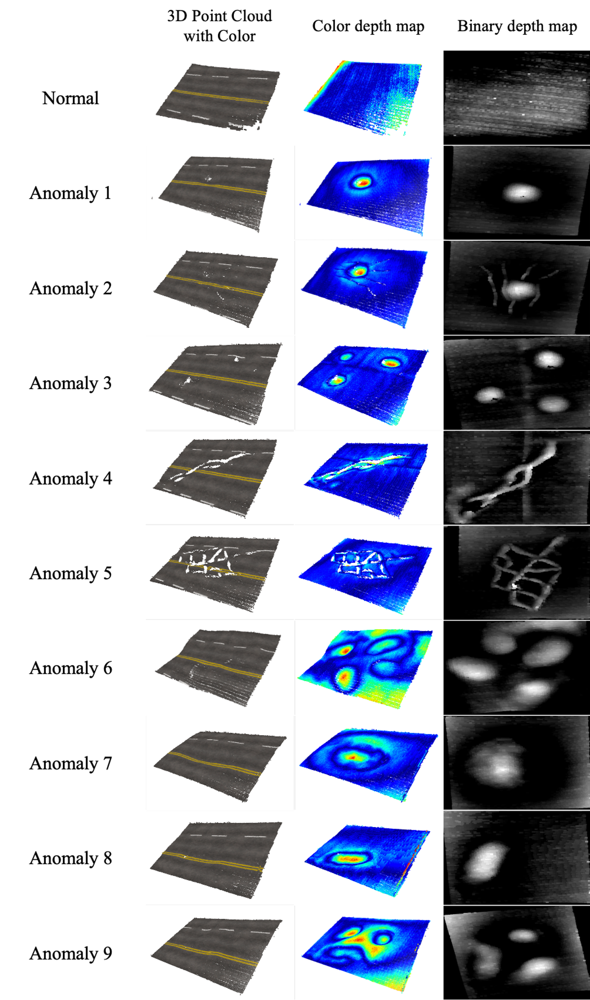
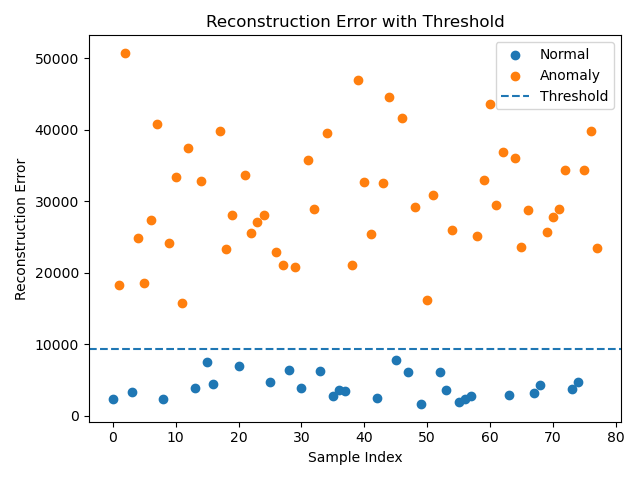
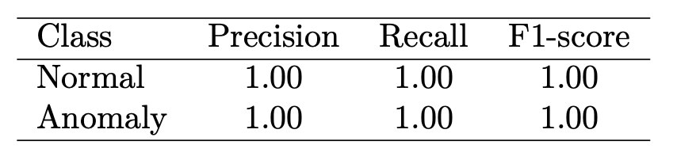

# SinkHole Detector using 3D point cloud with VAE

## ⭐️Abstract
### Total Process
    3d point cloud file(.pcd) 
    → depth map(gray scale image) 
    → VAE 
    → Result(Anomaly / Normal)

We utilized a Structured Light (SL) system to enable the early detection of sinkholes.
The SL system is capable of acquiring 3D depth maps with high precision, achieving an accuracy of approximately ±5 mm.

Based on the characteristics of this structured light system,
we collected 3D point cloud data from two scenarios:

roads in normal condition, and
roads showing early signs of anomalies before sinkhole formation.
Using these data, we generated depth maps and then applied an anomaly detection model based on a Variational Autoencoder (VAE).
Through this approach, we established a complete pipeline for the early detection of sinkhole-related anomalies.

## Sinkhole Dataset Construction
In real road environments, collecting large amounts of precursor data for sinkholes faces significant practical limitations. Therefore, a simulated dataset was constructed under controlled experimental conditions. A flat asphalt specimen was defined as the "Normal" state, and representative early-stage phenomena of sinkhole formation were precisely simulated on it.

- **Normal Data**

    A high-density 3D point cloud was acquired by scanning a defect-free, flat asphalt specimen measuring 150mm × 100mm from a single direction. This was used as the baseline normal model. To ensure data diversity, scans were conducted under 30 different angles and subtle lighting variation conditions.

- **Anomalous Data**

    On the normal specimen, the following sinkhole precursor scenarios were reproduced. For each scenario, five anomalous samples were produced and scanned, resulting in a total of 50 anomalous data samples.

- **Local Subsidence**

    A small circular depression with a diameter of 30mm and depth ranging from 1mm to 3mm was fabricated to simulate the initial subsidence of the upper ground caused by underground cavities.

- **Radial Micro-cracks**

    Fine cracks with a width of 0.5mm and a length of 50mm, radiating outward from the center of the subsidence point, were precisely engraved.

- **Composite Scenario**

    A complex situation combining both subsidence and cracking was implemented to evaluate the robustness of the model.

Considering these factors, the 3D point clouds obtained from the generated virtual road data are shown in the images below.

    

## Training Process

The model is trained only using depth map images of the normal state. The training objective is to compress the input normal images into a latent space and then reconstruct them to be as similar as possible to the original images. In this process, the VAE learns the intrinsic and essential features (manifold) of the normal data as a distribution in the latent space.

### Anomaly Detection Principle

When a new image is input to the trained VAE, the model attempts to reconstruct it based on the learned "features of normal data." If the input is a normal image, the model can reconstruct it well, resulting in a low reconstruction error between the original and reconstructed images. If the input is an anomalous image (including precursors of sinkholes), it deviates significantly from the distribution of the normal data learned by the model. Therefore, the model fails to reconstruct it properly, resulting in a very high reconstruction error. The pixel-wise difference (e.g., Mean Squared Error) between the input image and the reconstructed image is calculated and defined as the "anomaly score." If this score exceeds a predefined threshold, the image is classified as "anomalous."

### Result

    

    

    