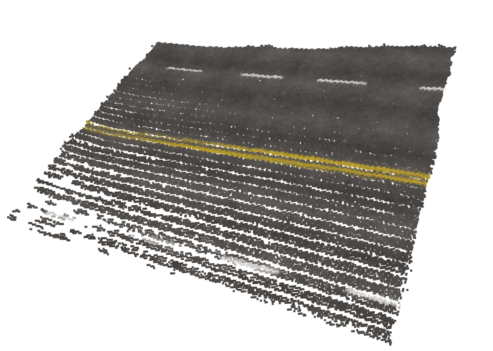
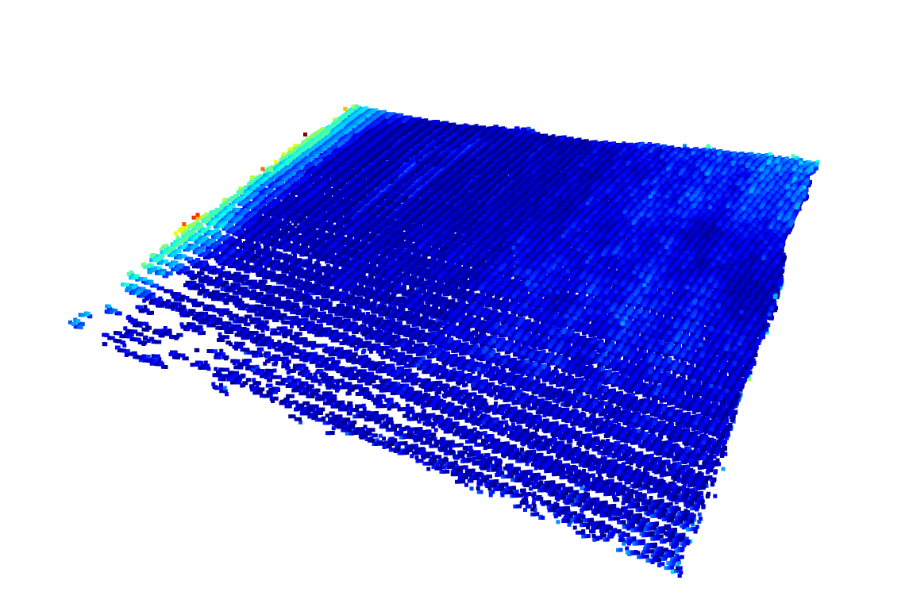
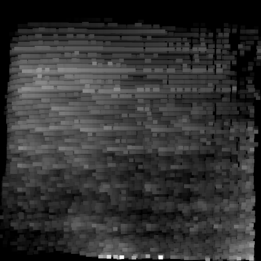
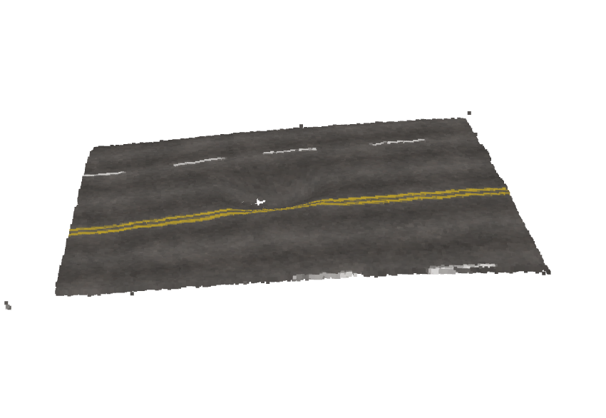
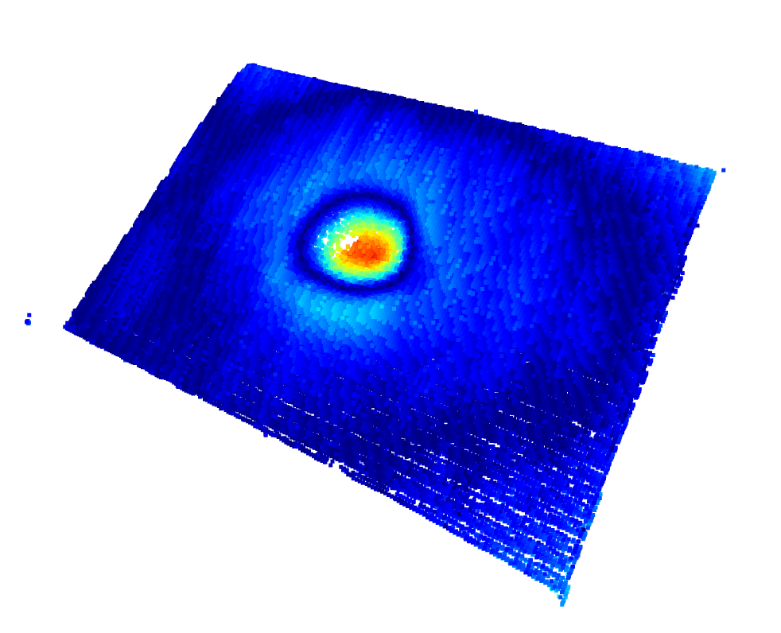
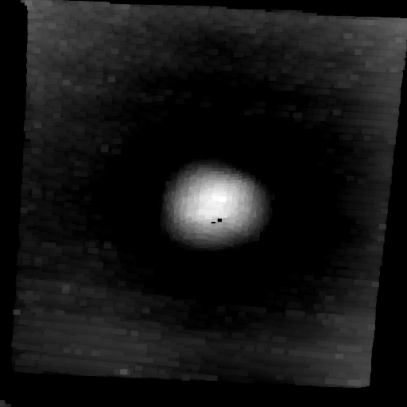
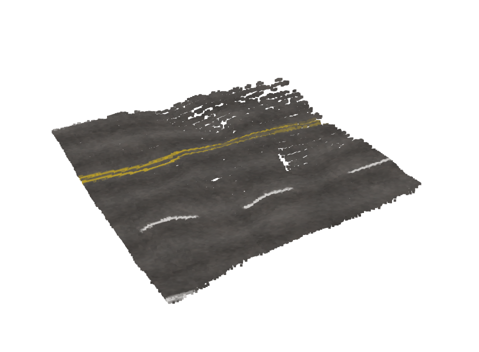
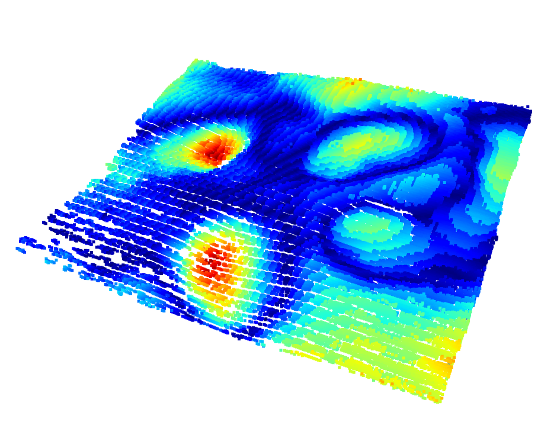
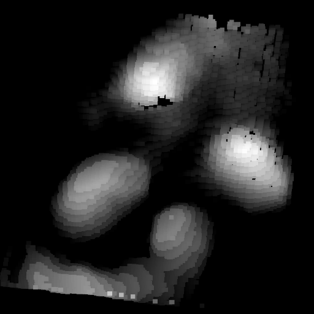

# SinkHole Detector using 3D point cloud with VAE

## ⭐️Abstract
We utilized a Structured Light (SL) system to enable the early detection of sinkholes.
The SL system is capable of acquiring 3D depth maps with high precision, achieving an accuracy of approximately ±5 mm.

Based on the characteristics of this structured light system,
we collected 3D point cloud data from two scenarios:

roads in normal condition, and
roads showing early signs of anomalies before sinkhole formation.
Using these data, we generated depth maps and then applied an anomaly detection model based on a Variational Autoencoder (VAE).
Through this approach, we established a complete pipeline for the early detection of sinkhole-related anomalies.

## 🔥 Process
### 1. **depth2img.py**
    3D point cloud file(.pcd) → depth map(gray scale image)
### ✅ Normal Data
<table>
    <tr>
        <th style="text-align:center;">3D point cloud</th>
        <th style="text-align:center;">Color depth map</th>
        <th style="text-align:center;">Gray depth map</th>
    </tr>
    <tr>
        <td></td>
        <td></td>
        <td></td>
    </tr>
</table>

### ❌ Abnormal Data
<table>
    <tr>
        <th style="text-align:center;">3D point cloud</th>
        <th style="text-align:center;">Color depth map</th>
        <th style="text-align:center;">Gray depth map</th>
    </tr>
    <tr>
        <td></td>
        <td></td>
        <td></td>
    </tr>
    <tr>
        <td></td>
        <td></td>
        <td></td>
    </tr>
</table>

### 2. **img_vae_train.py**
    Training VAE model with depth map images.

### 3. **inf_vae.py**
    3d point cloud file(.pcd) → depth map(gray scale image) → VAE → Result(Anomaly / Normal)